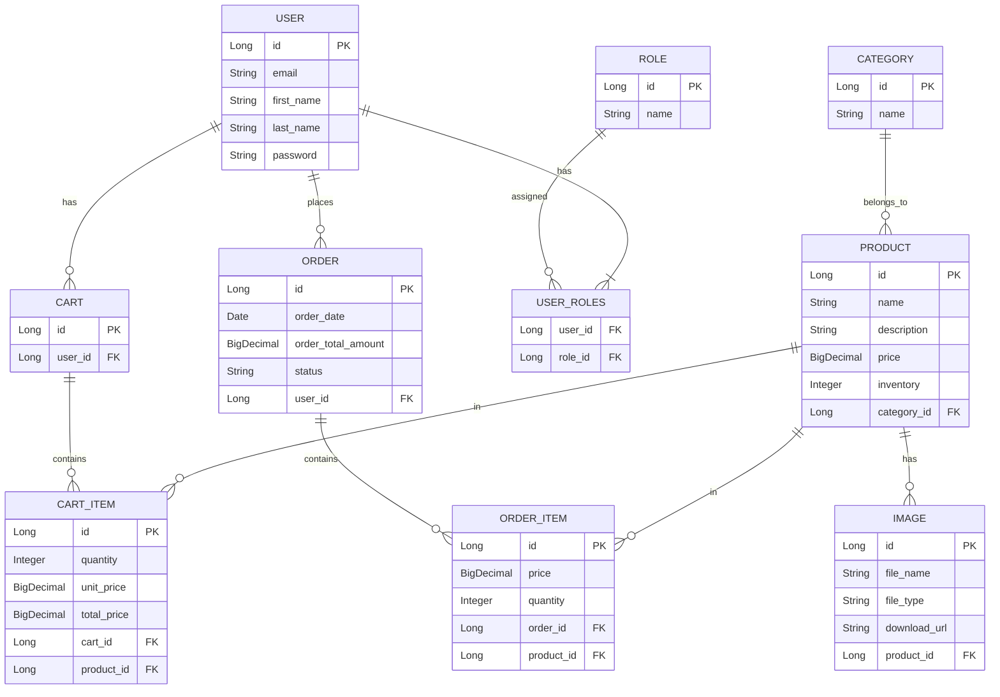

# E-Commerce Backend System


A full-featured e-commerce backend system with JWT authentication, product management, and shopping cart functionality.

## Features

### Core Modules
- **User Authentication**
  - JWT-based authentication/authorization
  - Role-based access control (Admin/User)
  - Secure password storage with BCrypt

- **Product Management**
  - CRUD operations for products
  - Category-based organization
  - Inventory tracking

- **Shopping Cart**
  - Add/remove items
  - Quantity management
  - Session persistence

- **Order Processing**
  - Order status tracking (Pending → Processing → Shipped → Delivered)
  - Order history

### Technical Highlights
- Spring Security with JWT
- RESTful API design
- Proper exception handling
- Data initialization with default admin/user accounts
- ModelMapper for DTO conversions
- Hibernate ORM with JPA

## API Endpoints

| Endpoint                | Method | Description                     | Auth Required |
|-------------------------|--------|---------------------------------|---------------|
| `/api/auth/login`       | POST   | User login                      | No            |
| `/api/products`         | GET    | List all products               | No            |
| `/api/products/{id}`    | GET    | Get product details             | No            |
| `/api/products`         | POST   | Create new product              | Admin         |
| `/api/cart/items`       | POST   | Add item to cart                | User          |
| `/api/cart/items/{id}`  | DELETE | Remove item from cart           | User          |

## Database Schema



## Installation

1. **Prerequisites**
    - Java 17+
    - MySQL 8.0+
    - Maven


2. **Configuration**
   Create `application.properties`:
   ```properties
   spring.datasource.url=jdbc:mysql://localhost:3306/ecommerce
   spring.datasource.username=root
   spring.datasource.password=yourpassword
   spring.jpa.hibernate.ddl-auto=update
   
   auth.jwt.secret=your-jwt-secret-key
   auth.jwt.expiration=86400000 # 24h
   ```

3. **Run**
   ```bash
   mvn spring-boot:run
   ```

## Initial Data

The system automatically creates on startup:
- Default roles: `ROLE_ADMIN`, `ROLE_USER`
- Admin user: `admin@example.com` / `123456`
- Test user: `user@example.com` / `123456`
- Sample categories and products

## Security

- JWT authentication
- Password encryption with BCrypt
- Role-based authorization
- CSRF protection
- Input validation